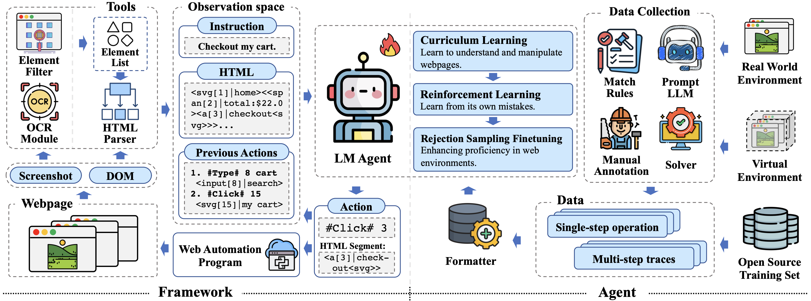

<h1>AutoWebGLM: Bootstrap And Reinforce A Large Language Model-based Web Navigating Agent</h1>

This is the official implementation of AutoWebGLM. If you find our open-sourced efforts useful, please 🌟 the repo to encourage our following development!

# Overview



AutoWebGLM is a project aimed at building a more efficient language model-driven automated web navigation agent. This project is built on top of the ChatGLM3-6B model, extending its capabilities to navigate the web more effectively and tackle real-world browsing challenges better. 

## Features

-   **HTML Simplification Algorithm**: Inspired by human browsing patterns, we've designed an algorithm to simplify HTML, making webpages more digestible for LLM agents while preserving crucial information.
-   **Hybrid Human-AI Training**: We combine human and AI knowledge to build web browsing data for curriculum training, enhancing the model's practical navigation skills.
-   **Reinforcement Learning and Rejection Sampling**: We enhance the model's webpage comprehension, browser operations, and efficient task decomposition abilities by bootstrapping it with reinforcement learning and rejection sampling.
-   **Bilingual Web Navigation Benchmark**: We introduce AutoWebBench—a bilingual (Chinese and English) benchmark for real-world web browsing tasks. This benchmark provides a robust tool for testing and refining the capabilities of AI web navigation agents.

# Evaluation

We have publicly disclosed our evaluation code, data, and environment. You may conduct the experiment using the following code.

## AutoWebBench & Mind2Web

You can find our evaluation datasets at <a href="./autowebbench/" alt="autowebbench">AutoWebBench</a> and <a href="./mind2web/" alt="mind2web">Mind2Web</a>. 
For the code to perform model inference, please refer to <a href="https://huggingface.co/THUDM/chatglm3-6b" alt="chatglm3-6b">ChatGLM3-6B</a>.
After obtaining the output file, the score can be obtained through ```python eval.py [result_path]```.

## WebArena

We have made modifications to the WebArena environment to fit the interaction of our system; see <a href="./webarena/" alt="webarena">WebArena</a>. The modifications and execution instructions can be found in <a href="./webarena/README.md" alt="readme">README</a>.

## MiniWob++

We have also made modifications to the MiniWob++ environment, see <a href="./miniwob++/" alt="miniwob++">MiniWob++</a>. The modifications and execution instructions can be found in <a href="./miniwob++/README.md" alt="readme">README</a>.

# License

This repository is licensed under the [Apache-2.0 License](LICENSE). All open-sourced data is for resarch purpose only.

# Citation

TODO
